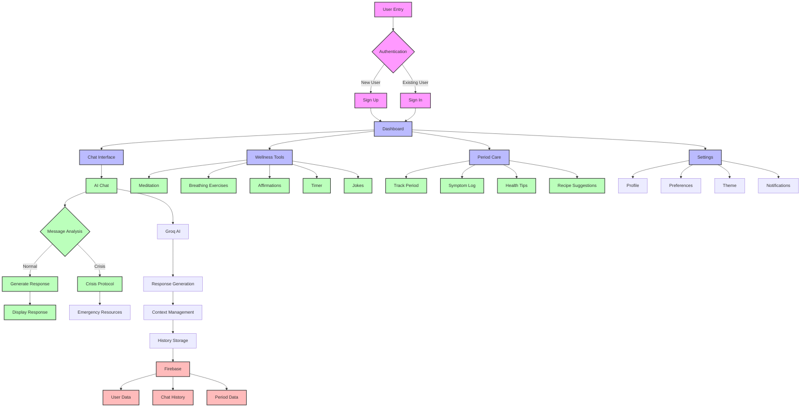
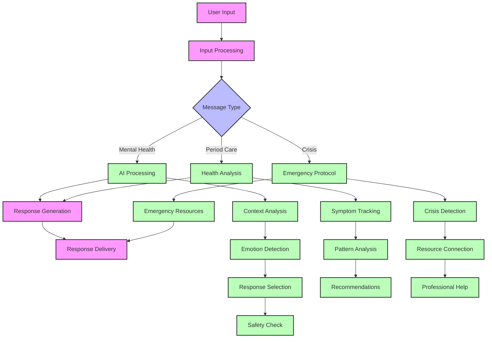
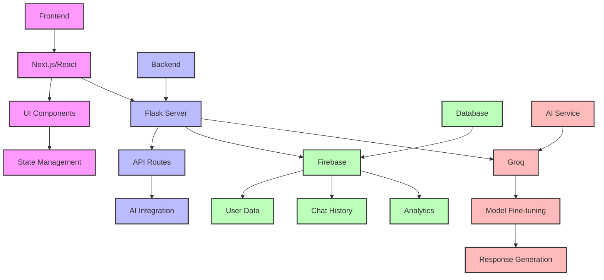

```mermaid
graph TD
    %% Main Application Flow
    A[User Entry] --> B{Authentication}
    B -->|New User| C[Sign Up]
    B -->|Existing User| D[Sign In]
    C --> E[Dashboard]
    D --> E

    %% Main Features
    E --> F[Chat Interface]
    E --> G[Wellness Tools]
    E --> H[Period Care]
    E --> I[Settings]

    %% Chat Flow
    F --> J[AI Chat]
    J --> K{Message Analysis}
    K -->|Normal| L[Generate Response]
    K -->|Crisis| M[Crisis Protocol]
    L --> N[Display Response]
    M --> O[Emergency Resources]

    %% Wellness Tools
    G --> P[Meditation]
    G --> Q[Breathing Exercises]
    G --> R[Affirmations]
    G --> S[Timer]
    G --> T[Jokes]

    %% Period Care
    H --> U[Track Period]
    H --> V[Symptom Log]
    H --> W[Health Tips]
    H --> X[Recipe Suggestions]

    %% Settings
    I --> Y[Profile]
    I --> Z[Preferences]
    I --> AA[Theme]
    I --> AB[Notifications]

    %% Backend Integration
    J --> AC[Groq AI]
    AC --> AD[Response Generation]
    AD --> AE[Context Management]
    AE --> AF[History Storage]

    %% Database
    AF --> AG[Firebase]
    AG --> AH[User Data]
    AG --> AI[Chat History]
    AG --> AJ[Period Data]

    %% Styling
    classDef primary fill:#f9f,stroke:#333,stroke-width:2px
    classDef secondary fill:#bbf,stroke:#333,stroke-width:2px
    classDef feature fill:#bfb,stroke:#333,stroke-width:2px
    classDef database fill:#fbb,stroke:#333,stroke-width:2px

    class A,B,C,D primary
    class E,F,G,H,I secondary
    class J,K,L,M,N,P,Q,R,S,T,U,V,W,X feature
    class AG,AH,AI,AJ database
```

```mermaid
graph TD
    %% Data Flow
    A1[User Input] --> B1[Input Processing]
    B1 --> C1{Message Type}
    
    C1 -->|Mental Health| D1[AI Processing]
    C1 -->|Period Care| E1[Health Analysis]
    C1 -->|Crisis| F1[Emergency Protocol]
    
    D1 --> G1[Response Generation]
    E1 --> G1
    F1 --> H1[Emergency Resources]
    
    G1 --> I1[Response Delivery]
    H1 --> I1
    
    %% AI Processing
    D1 --> J1[Context Analysis]
    J1 --> K1[Emotion Detection]
    K1 --> L1[Response Selection]
    L1 --> M1[Safety Check]
    
    %% Health Analysis
    E1 --> N1[Symptom Tracking]
    N1 --> O1[Pattern Analysis]
    O1 --> P1[Recommendations]
    
    %% Emergency Protocol
    F1 --> Q1[Crisis Detection]
    Q1 --> R1[Resource Connection]
    R1 --> S1[Professional Help]
    
    %% Styling
    classDef process fill:#f9f,stroke:#333,stroke-width:2px
    classDef decision fill:#bbf,stroke:#333,stroke-width:2px
    classDef data fill:#bfb,stroke:#333,stroke-width:2px
    
    class A1,B1,G1,I1 process
    class C1 decision
    class D1,E1,F1,H1,J1,K1,L1,M1,N1,O1,P1,Q1,R1,S1 data
```

```mermaid
graph TD
    %% System Architecture
    A2[Frontend] --> B2[Next.js/React]
    B2 --> C2[UI Components]
    C2 --> D2[State Management]
    
    E2[Backend] --> F2[Flask Server]
    F2 --> G2[API Routes]
    G2 --> H2[AI Integration]
    
    I2[Database] --> J2[Firebase]
    J2 --> K2[User Data]
    J2 --> L2[Chat History]
    J2 --> M2[Analytics]
    
    N2[AI Service] --> O2[Groq]
    O2 --> P2[Model Fine-tuning]
    P2 --> Q2[Response Generation]
    
    %% Integration Points
    B2 --> F2
    F2 --> J2
    F2 --> O2
    
    %% Styling
    classDef frontend fill:#f9f,stroke:#333,stroke-width:2px
    classDef backend fill:#bbf,stroke:#333,stroke-width:2px
    classDef database fill:#bfb,stroke:#333,stroke-width:2px
    classDef ai fill:#fbb,stroke:#333,stroke-width:2px
    
    class A2,B2,C2,D2 frontend
    class E2,F2,G2,H2 backend
    class I2,J2,K2,L2,M2 database
    class N2,O2,P2,Q2 ai
``` 